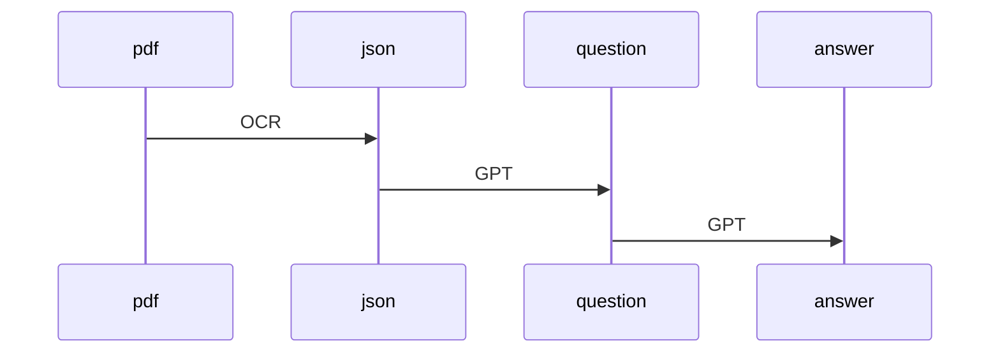

# SnapAnswer

## 适用场景

在不平整的台面上拍摄或扫描文件，得到的 pdf 文件经过常规的 OCR 往往会出现识别错误的情况。

## 操作流程

```mermaid
sequenceDiagram
    pdf->>json: OCR
    json->>question: GPT
    question->>answer: GPT
```

## 准备

1. 百度云 OCR API（有免费额度）
2. OpenAI API（自行获取）